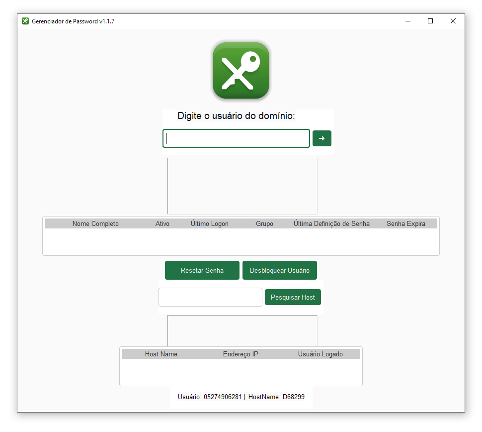

# Gerenciador de Senha de Domínio
## Com este programa que desenvolvi em Python, é possível gerenciar desbloqueios e resets de senhas de usuários no Active Directory, obviamente com privilégios de Administrador

Inserido em um domínio o qual o host é administrador, utilizando a ferramenta, é possível
desbloquear usuários do domínio, resetar senhas e mais apenas com pequenos cliques



### A senha padrão é a que está no arquivo senhapadrao.txt
#### Ela pode ser alterada para a senha desejada a ser usada no botão de Resetar o Usuário

> senhapadrao.txt
```
senhapadrao
```

### A coluna grupos é definida pelo arquivo setores.txt, o qual
### deve conter os grupos de cada departamento (Exemplo: ASCOM)

> setores.txt
```
setor1,setor2,setor3,setor4,setor5,setor6,Estagiarios
```

### O Logo pode ser alterado, apenas substituindo as imagens logo_b.png
### e também a logo_p.png, onde a logo_b é quando o Windows usa tema claro
### e logo_p.png é quando o Windows está em dark mode
